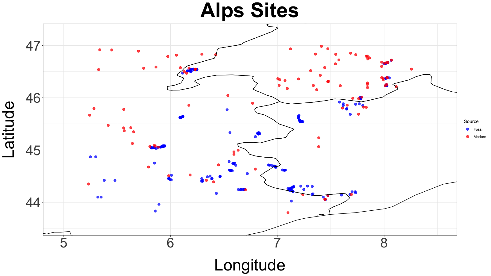
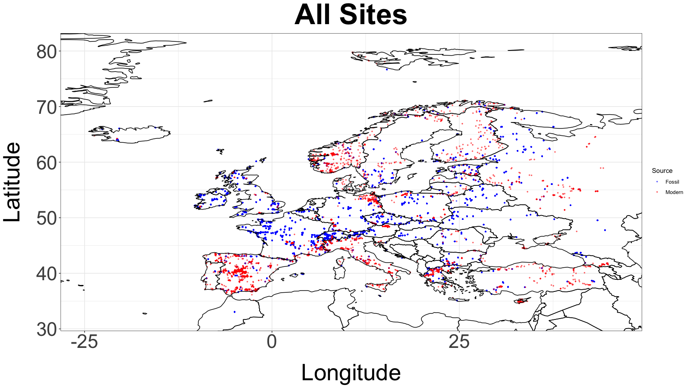
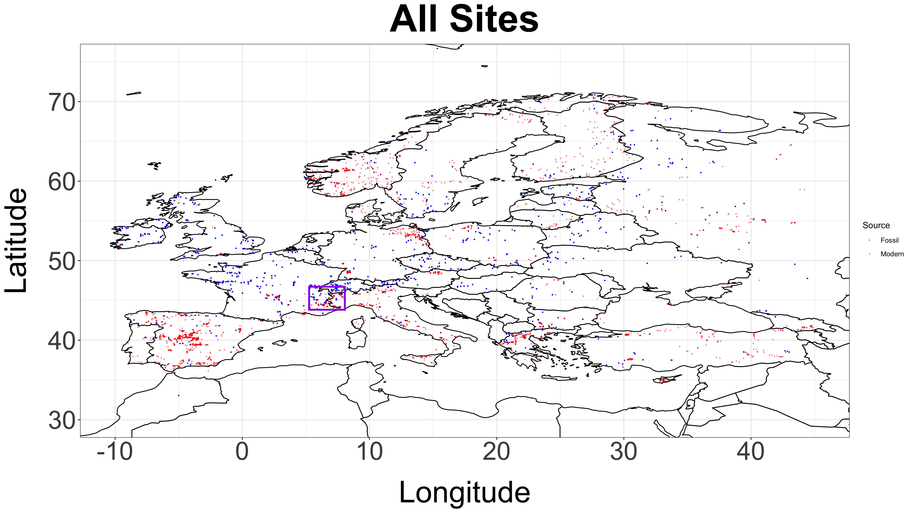
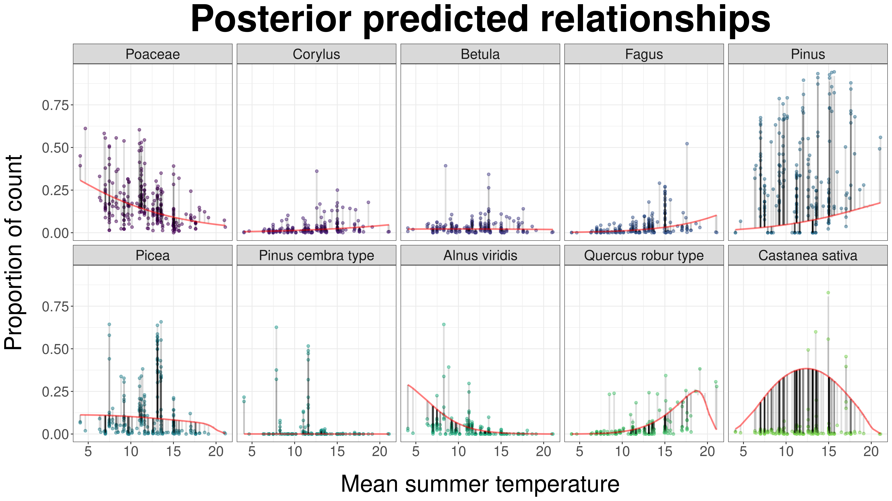
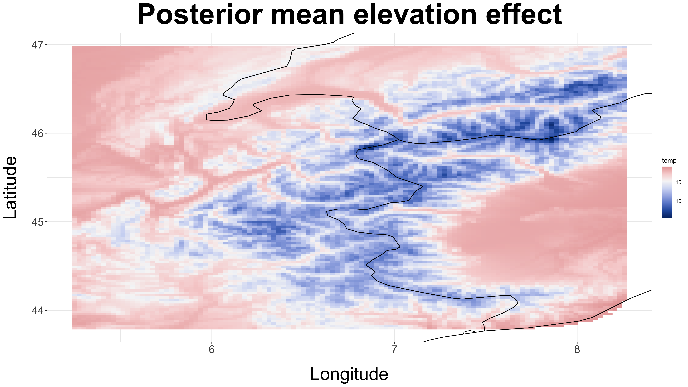
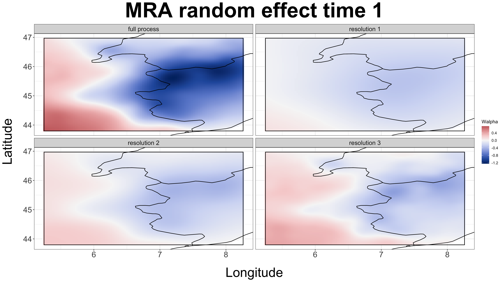
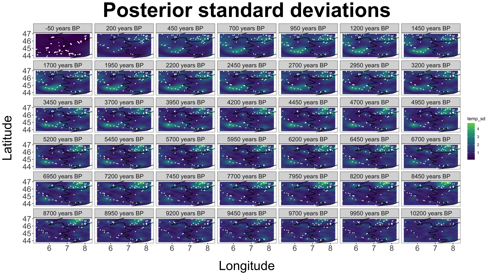
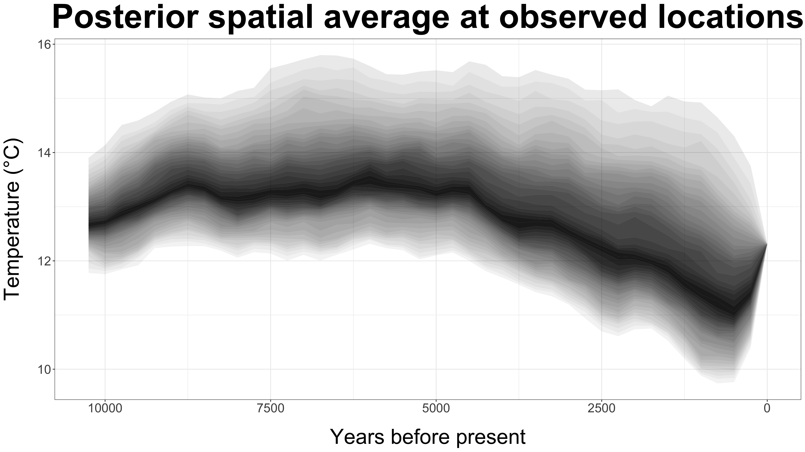
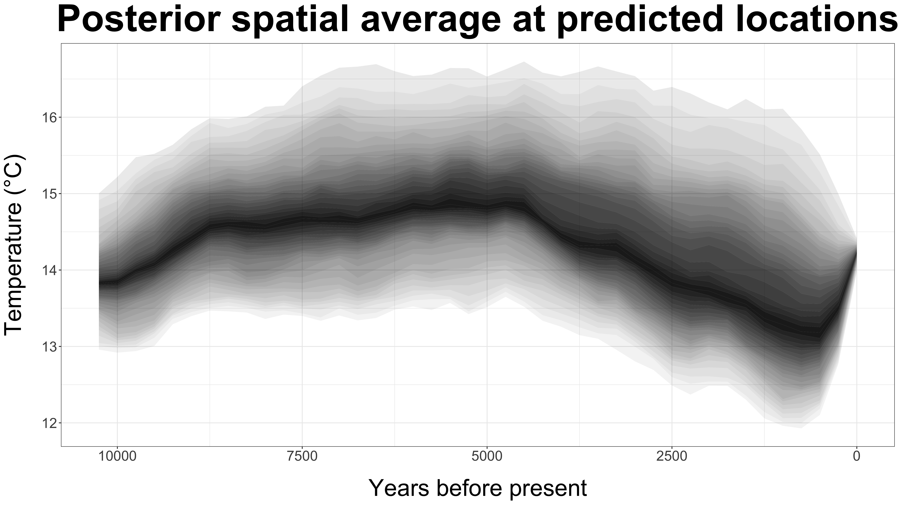

<!--                          -->
<!-- Turn off slide numbering -->
<!--                          -->

<style type="text/css">
slides > slide:not(.nobackground):after {
  content: '';
}
</style>
  
\newcommand{\bs}[1]{\boldsymbol{#1}}
\newcommand{\bm}[1]{\mathbf{#1}}
\newcommand{\oN}[1]{\operatorname{#1}}

<!-- To stop inf_mr, use:
servr::daemon_stop(1)
 -->
 
```{r setup, include=FALSE}
knitr::opts_chunk$set(echo = FALSE)
library(tidyverse)
library(knitr)
library(pgR)
library(mvnfast)
library(knitcitations)
```

```{r, echo=FALSE, message=FALSE}
biblio <- bibtex::read.bib("pg.bib")
# biblio <- bibtex::read.bib(here("2018", "mizzou", "mizzou", "mizzou.bib"))
# renv::init()
# renv::snapshot()
renv::restore()
```


<!-- ## Pollen is widely available across the globe -->

<!-- <center> -->
<!-- <video width="600" height="480" muted controls> -->
<!--   <source src="./pollen.mp4" type="video/mp4"> -->
<!-- </video> -->
<!-- </center> -->

# WNAR 2021 | Recent Advancements in Spatio-Temporal Modeling 

## Overview

* Spatio-temporal reconstruction of climate from pollen.

    1) Non-linear functional relationship.
    
        * Computationally challenging.
        
        * Non-linear and non-Gaussian relationships among data.
    
    2) Using data/parameter augmentation to improve computation.


## Pollen is a unique paleoclimate proxy

- Globally distributed.

<hr style="height:18px; visibility:hidden;" />

- Trees are long-lived -- little evolutionary drift during the Holocene.

<hr style="height:18px; visibility:hidden;" />

- Current species distributions with respect to climate are well understood.

<hr style="height:18px; visibility:hidden;" />

- Many databases of pollen data.
    - [Neotoma](https://www.neotomadb.org/groups/category/pollen).
    - [European Pollen Database](http://www.europeanpollendatabase.net/index.php).
    - [Global Pollen Database](https://ecologicaldata.org/wiki/global-pollen-database).
    - [NOAA Pollen Database](https://www.ncdc.noaa.gov/data-access/paleoclimatology-data/datasets/pollen).


## Modeling goal

- Link the observed pollen counts to climate states during the modern period.

<hr style="height:24px; visibility:hidden;" />

- Use the learned relationship to predict unobserved climate state.

<hr style="height:24px; visibility:hidden;" />

- Generate climate histories that are local to the site of interest with uncertainty.

<hr style="height:160px; visibility:hidden;" />


<font size="3">
`r paste0(capture.output(print(biblio["tipton2019predicting"])), collapse = " ")`
</font>


## Setting the stage 

- Spatially explicit reconstructions of climate variables are important.

    <hr style="height:12px; visibility:hidden;" />

    - Many important ecological questions are local.
    
    <hr style="height:12px; visibility:hidden;" />

    - Predictions at all locations remove the effects of sampling bias in paleoclimate reconstruction.


<hr style="height:24px; visibility:hidden;" />

## Setting the stage 

- Prior work -- **4 pollen cores** and total compute time of approximately 28 hours.

    <hr style="height:24px; visibility:hidden;" />

- Currently: 363 sites:
    - non-linear response: compute time $\approx$ 48 hours.
    - P&oacute;lya-gamma linear response: compute time less than 2 hours.


<hr style="height:150px; visibility:hidden;" />

<font size="3">
`r paste0(capture.output(print(biblio["holmstrom2015bayesian"])), collapse = " ")`
</font>

---

```{r, fig.align='center', out.width = '100%'}
 
```

---

```{r, fig.align='center', out.width = '100%'}
#  
 
```

# Non-linear response model

## Data model 


* Sediment samples from a lake.

<hr style="height:18px; visibility:hidden;" />

* Take 1cm$^3$ cubes along the length of the sediment core.

<hr style="height:18px; visibility:hidden;" />

* In each cube, researcher counts the first $M$ pollen grains and identifies to species/OTU.

<hr style="height:18px; visibility:hidden;" />

* Raw data are counts of each species.

<hr style="height:18px; visibility:hidden;" />

- Compositional count data.

## Data Model

For the $i$th observation at location $\mathbf{s}$ and time $t$, 

<hr style="height:12px; visibility:hidden;" />

$$
\begin{align*}
\mathbf{y}_i \left( \mathbf{s}, t \right) & = \left( y_{i1} \left( \mathbf{s}, t \right), \ldots, y_{ij} \left( \mathbf{s}, t \right) \right)'
\end{align*}
$$

<hr style="height:122x; visibility:hidden;" />

is a $J$-dimensional compositional count observation.

<hr style="height:24px; visibility:hidden;" />

* $y_{ij} \left( \mathbf{s}, t \right)$ is the count of species $j$ in the $i$th sample at location $\mathbf{s}$ and time $t$.

## Data Model
$$
\begin{align*}
\mathbf{y}_i \left( \mathbf{s}, t \right) | \mathbf{p}\left( \mathbf{s}, t \right) & \sim \operatorname{Multinomial} \left( M_i \left( \mathbf{s}, t \right), \mathbf{p}\left( \mathbf{s}, t \right) \right).
\end{align*}
$$

<hr style="height:24px; visibility:hidden;" />

* $M_i \left( \mathbf{s}, t \right) = \sum_{j=1}^J y_{ij}\left( \mathbf{s}, t \right)$ is the total count observed (fixed and known) for observation $i$ at location $\mathbf{s}$ and time $t$.

<hr style="height:24px; visibility:hidden;" />

* Observation informative of the relative proportions $p_{j} \left( \mathbf{s}, t \right)$ only.

<hr style="height:24px; visibility:hidden;" />


## Data Model: Overdispersion

* The pollen data are highly variable and overdispersed.

    <hr style="height:12px; visibility:hidden;" />

* Mixture over a Dirichlet distribution. 

    <hr style="height:12px; visibility:hidden;" />

$$
\begin{align*}
\mathbf{p}\left( \mathbf{s}, t \right) | \boldsymbol{\alpha}\left( \mathbf{s}, t \right) & \sim \operatorname{Dirichlet} \left( \boldsymbol{\alpha}\left( \mathbf{s}, t \right) \right).
\end{align*}
$$

<hr style="height:24px; visibility:hidden;" />

* Marginalize out $\mathbf{p} \left( \mathbf{s}, t \right)$.

<hr style="height:24px; visibility:hidden;" />

$$
 \begin{align*}
\mathbf{y}_i\left( \mathbf{s}, t \right) | \boldsymbol{\alpha}\left( \mathbf{s}, t \right) & \sim \operatorname{Dirichlet-Multinomial} \left( M_i\left( \mathbf{s}, t \right), \boldsymbol{\alpha}\left( \mathbf{s}, t \right) \right).
\end{align*}
$$

<br />

## Data Model: Overdispersion

* Model the Dirichlet-multinomial random effect using the log link function:

<hr style="height:12px; visibility:hidden;" />

$$
\begin{align*}
\operatorname{log} \left( \boldsymbol{\alpha} \left( \mathbf{s}, t \right) \right) & = f \left( \mathbf{z}\left( \mathbf{s}, t \right) \right) \boldsymbol{\beta}.
\end{align*}
$$

<hr style="height:12px; visibility:hidden;" />

* $\mathbf{z}\left( \mathbf{s}, t \right)$' is a $q$-dimensional vector of climate variables. 

<hr style="height:24px; visibility:hidden;" />

* $f(\cdot)$ is some function of the climate state.

<hr style="height:24px; visibility:hidden;" />

* $\boldsymbol{\beta}$ is a $q \times J$ dimensional matrix of regression coefficients.
    
---

<hr style="height:8px; visibility:hidden;" />

```{r, out.width='100%', fig.align = 'center', echo=FALSE}
knitr::include_graphics(here::here("images", "alps-functional-fit-all-models-subset.png")) 
```

## Response Function

$$
\begin{align*}
\operatorname{log} \left( \boldsymbol{\alpha} \left( \mathbf{s}, t \right) \right) & = f \left( \mathbf{z}\left( \mathbf{s}, t \right) \right) \boldsymbol{\beta}.
\end{align*}
$$

<hr style="height:8px; visibility:hidden;" />

* $f \left( \mathbf{z}\left( \mathbf{s}, t \right) \right)$ is a basis expansion of the covariates $\mathbf{z}\left( \mathbf{s}, t \right)$.
    * Use B-splines or Gaussian Processes as a basis.
    * $\mathbf{z}\left( \mathbf{s}, t \right)$ is unknown for $t \neq 1$.  
    * Computationally challenging.

<hr style="height:60px; visibility:hidden;" />

<font size="3">
`r paste0(capture.output(print(biblio["tipton2019predicting"])), collapse = " ")`

<!-- <hr style="height:1px; visibility:hidden;" /> -->
`r paste0(capture.output(print(biblio["hefley2017basis"])), collapse = " ")`
</font>


## Calibration

* $\mathbf{z} \left( \mathbf{s}, t \right)$s are observed only at $t$ = 1.

<br />

* Calibration: Estimate $\boldsymbol{\beta}$ using:
$$
\begin{align*}
\mathbf{y} \left(1\right) & = \left( \mathbf{y} \left( \mathbf{s}_1, 1 \right), \ldots, \mathbf{y} \left( \mathbf{s}_n, 1 \right) \right)' \\
\mathbf{z} \left(1\right) & = \left( \mathbf{z} \left( \mathbf{s}_1, 1 \right), \ldots, \mathbf{z} \left( \mathbf{s}_n, 1 \right) \right)'.
\end{align*}
$$

<br />

* Reconstruction:
    * Use estimated $\boldsymbol{\beta}$s and fossil pollen $\mathbf{y} \left( t \right)$ to predict unobserved $\mathbf{z}\left( t \right)$.

<br />


## Dynamic Model

* For $\mathbf{z} \left(t \right) = \left( \mathbf{z} \left(\mathbf{s}_1, t \right)', \ldots,  \mathbf{z} \left(\mathbf{s}_n, t \right)' \right)$, we assume:

<hr style="height:8px; visibility:hidden;" />

$$
\begin{align*}
\mathbf{z} \left(t \right) - \mathbf{X} \left( t \right) \boldsymbol{\gamma} & = \mathbf{M}\left(t\right) \left( \mathbf{z} \left(t-1 \right) - \mathbf{X} \left( t \right) \boldsymbol{\gamma} \right) + \boldsymbol{\eta} \left(t \right).
\end{align*}
$$

<hr style="height:8px; visibility:hidden;" />

* $\mathbf{M}(t) = \rho \mathbf{I}_n$ is a propagator matrix.

* $\mathbf{X} \left(t \right) \boldsymbol{\gamma}$ are the fixed effects from covariates like latitude, elevation, etc.

* $\boldsymbol{\eta} \left( t \right) \sim \operatorname{N} \left( \mathbf{0}, \mathbf{R}\left( \boldsymbol{\theta} \right) \right)$.

* $\mathbf{R} \left( \boldsymbol{\theta} \right)$ is a Mátern spatial covariance matrix with parameters $\boldsymbol{\theta}$.

## Elevation 

```{r, out.width='95%', echo=FALSE}
knitr::include_graphics(here::here("images", "alps-elevation.png"))
```

## Scaling the process for big data

* Define a set of spatial knot locations $\mathbf{s}^{\star} = \left\{ \mathbf{s}_1^{\star}, \ldots, \mathbf{s}_m^{\star} \right\}$.

$$
\boldsymbol{\eta}^{\star} \left( t \right) \sim \operatorname{N} \left( \mathbf{0}, \mathbf{R}^{\star}\left( \boldsymbol{\theta} \right) \right).
$$


* $\mathbf{R}^{\star}\left( \boldsymbol{\theta} \right)$ is the spatial covariance defined at the knot locations $\mathbf{s}^{\star}$.


<hr style="height:200px; visibility:hidden;" />

<font size="3">
`r paste0(capture.output(print(biblio["banerjee2008gaussian"])), collapse = " ")`
</font>

## Predictive Process

* Linear interpolator from observed locations $\mathbf{s}$ to knot locations $\mathbf{s}_j^{\star}$ is 
$$
\mathbf{r} \left(\mathbf{s}, \mathbf{s}_j^{\star} \right) \mathbf{R}^{\star}\left( \boldsymbol{\theta} \right)^{-1},
$$
where $\mathbf{r} \left(\mathbf{s}, \mathbf{s}_j^{\star} \right) 
=  \operatorname{Cov} \left(\mathbf{s}, \mathbf{s}_j^{\star} \right)$.

* $\boldsymbol{\eta} \left( t \right) \approx \mathbf{r} \left(\mathbf{s}, \mathbf{s}^{\star} \right) \mathbf{R}^{\star}\left( \boldsymbol{\theta} \right)^{-1} \boldsymbol{\eta}^{\star} \left( t \right)$.

<hr style="height:6px; visibility:hidden;" />

* The dynamic climate process is approximated by

$$
\begin{align*}
\mathbf{z} \left(t \right) - \mathbf{X} \left( t \right) \boldsymbol{\gamma} & = \mathbf{M}\left(t\right) \left( \mathbf{z} \left(t-1 \right) - \mathbf{X} \left( t \right) \boldsymbol{\gamma} \right) + \mathbf{r} \left(\mathbf{s}, \mathbf{s}^{\star} \right) \mathbf{R}^{\star}\left( \boldsymbol{\theta} \right)^{-1} \boldsymbol{\eta}^{\star} \left(t \right).
\end{align*}
$$


<!-- ## Time Uncertainty -->

<!-- * Each fossil pollen observation includes estimates of time uncertainty. -->
<!--     * The time of the observation is uncertain. -->
<!--     * Weight the likelihoods according to age-depth model. -->
<!--     * Posterior distribution of ages. -->

<!-- <br /> -->

<!-- * For each observation fossil pollen observation an age-depth model gives a posterior distribution over dates. -->
<!--     * Define $\omega \left(\mathbf{s}, t \right)$ as P(age $\in (t-1, t)$).  -->
<!--     * $[\mathbf{y} \left( \mathbf{s}, t \right) | \boldsymbol{\alpha} \left( \mathbf{s}, t \right) ] = \prod_{t=1}^T [\mathbf{y} \left( \mathbf{s}, t \right) | \boldsymbol{\alpha} \left( \mathbf{s}, t \right)]^{\omega_\left(\mathbf{s}, t \right)}$. -->

# Implementation

## gitHub package

* Non-spatial code available in the gitHub package [BayesComposition](https://github.com/jtipton25/BayesComposition).


<br />

* Includes options for multiple models including:
    * mixture models.
    * different likelihoods and link functions.
    * correlations in functional response.

<br />

* Leverages code in `C++` using `Rcpp` package for computation speed.


## Computational Details

1) Fit the calibration model.

2) Use posterior distribution from stage (1) to generate predictions of climate independent in space and time.

3) Smooth the posterior distribution from stage (2) using dynamic linear model.

    * Use posterior mean estimates which does not fully quantify model uncertainty.

    * Goal: Use recursive Bayesian ideas from end of talk.
 

4) Fully Bayesian joint estimation.

<hr style="height:60px; visibility:hidden;" />

<font size="3">
`r paste0(capture.output(print(biblio["hooten2019prior"])), collapse = " ")`
</font>


## Estimation of $\mathbf{z} \left(\mathbf{s}, t \right)$

* High-dimensional spatio-temporal process.
    * Inefficient to sample with block Metropolis.
    * Poor mixing of MCMC chains.
    
<br />

* Non-linear transformation in the data model.
    * Difficult to use Kalman Filtering. 
    
<br />

* Particle Filtering Methods.
    * Difficult to implement, suffer from degeneracy.
    * Posterior can be multi-modal.
    
    
## Estimation of $\mathbf{z} \left(\mathbf{s}, t \right)$

* Elliptical Slice Sampling.
    * Assumes a Gaussian prior.
    * Requires no tuning.
    * Efficiently samples in high dimensions.
    * Easily explores multiple modes.

<hr style="height:12px; visibility:hidden;" />

* Adaptive block Metropolis within Gibbs and Elliptical Slice Sampling algorithms.

<hr style="height:12px; visibility:hidden;" />

* Highly multi-modal posterior is efficiently explored within the sampler.

<hr style="height:12px; visibility:hidden;" />

<font size="3">
`r paste0(capture.output(print(biblio["murray2010elliptical"])), collapse = " ")`
</font>

## Estimation of $\mathbf{z} \left(\mathbf{s}, t \right)$

* For Gaussian process expansion of $\mathbf{z} \left( \mathbf{s}, t \right)$:
    * The latent climate states are inputs into the covariance function.
    * Covariance input locations (and distance) are random.
    * Unique computational challenge.
        * Total computational cost is prohibitive $O(d \frac{(Tn)^3}{3})$.
    
* Proposed solution:
    * Predictive process representation.
    * Reduced computation cost $O(d T \frac{m^3}{3})$.
    
<!-- ## Elliptical Slice Sampling for DLMs -->

<hr style="height:12px; visibility:hidden;" />

<font size="3">
`r paste0(capture.output(print(biblio["tipton2019predicting"])), collapse = " ")`
</font>


## Reconstruction

```{r, out.width = "33%"}
knitr::include_graphics(c(
  here::here("images", "alps-predictions-mean-bspline.png"),
  here::here("images", "alps-predictions-anomalies-mean-bspline.png"),
  here::here("images", "alps-predictions-anomalies-sd-bspline.png")))
```


<!-- ```{r, eval=TRUE} -->
<!-- load("~/Google Drive/spatial-pollen/fit/fossil-prediction-elevation-nimble.RData") -->
<!-- load("~/Google Drive/spatial-pollen/fit/elevation-grid.RData") -->
<!-- N <- sqrt(nrow(Z_pred_full)) -->
<!-- tt <- ncol(Z_pred_full) -->
<!-- n_grid <- nrow(pred.grid) -->
<!-- ``` -->


<!-- ```{r} -->
<!-- Z_mean_full_mat <- Z_pred_full -->
<!-- for (t in 1:tt) { -->
<!--   Z_mean_full_mat[, t] <- Z_mean_full -->
<!-- } -->
<!-- dat_pred <- data.frame( -->
<!--   climate = c(Z_pred_full), -->
<!--   # climate = c(X_mean_full), -->
<!--   anomaly = c(Z_pred_full - Z_mean_full_mat) / sd(c(Z_pred_full - Z_mean_full_mat)), -->
<!--   long    = rep(pred.grid[, 1], times=tt), -->
<!--   lat     = rep(pred.grid[, 2], times=tt), -->
<!--   year    = rep(1:tt, each=n_grid) -->
<!-- ) -->
<!-- world <- map_data("world") # we already did this, but we can do it again -->
<!-- world <- subset(world, region %in% c("Italy", "Switzerland", "France")) -->
<!-- ``` -->


<!-- ```{r reconstruction, fig.show='animate', cache=TRUE, message=FALSE, warning=FALSE, interval = 0.5} -->
<!-- zlims <- range(dat_pred$climate) -->
<!-- alims <- range(dat_pred$anomaly)  -->
<!-- for (t in 1:tt) { -->
<!--   g_climate <- ggplot(data = subset(dat_pred, year==t), -->
<!--                       aes(x = long, y = lat, fill = climate)) + -->
<!--     geom_tile() + -->
<!--     # geom_point(data = dat_fossil_climate, aes(x = long, y = lat, fill=X, color=X), -->
<!--     #            size=0.25, alpha=1.0, inherit.aes=FALSE) + -->
<!--     # scale_fill_continuous(low = "blue", high = "red", limits=zlims) + -->
<!--     scale_fill_gradient2(low = "blue", mid="white", midpoint = sum(zlims)/2,  -->
<!--                          high = "red", limits=zlims) + -->
<!--         # scale_color_brewer(palette = "RdYlBu") + -->
<!--     geom_path(data = world, aes(x = long, y = lat, group = group), -->
<!--                  inherit.aes = FALSE, -->
<!--                  color = "black") + -->
<!--     coord_fixed(1.3) + -->
<!--     xlim(4.5, 9.5) +  -->
<!--     ylim(43.5, 47.5) +  -->
<!--     xlab("Longitude") + -->
<!--     ylab("Latitude") + -->
<!--     ggtitle(paste("Estimated climate for", 250 * (t-1), "to",  250 * t)) + -->
<!--     theme_bw() -->
<!--   g_anomaly <- ggplot(data = subset(dat_pred, year==t), -->
<!--                       aes(x = long, y = lat, fill = anomaly)) + -->
<!--     geom_tile() + -->
<!--     # geom_point(data = dat_fossil_climate, aes(x = long, y = lat, fill=X, color=X), -->
<!--     #            size=0.25, alpha=1.0, inherit.aes=FALSE) + -->
<!--     # scale_fill_continuous(low = "blue", high = "red", limits=alims) + -->
<!--     scale_fill_gradient2(low = "blue", mid = "white", midpoint = 0,  -->
<!--                          high = "red", limits = alims) + -->
<!--     # scale_color_continuous(pallette = "RdYlBu") +  -->
<!--     geom_path(data = world, aes(x = long, y = lat, group = group), -->
<!--                  inherit.aes = FALSE, -->
<!--                  color = "black") + -->
<!--     coord_fixed(1.3) + -->
<!--     xlim(4.5, 9.5) +  -->
<!--     ylim(43.5, 47.5) +  -->
<!--     xlab("Longitude") + -->
<!--     ylab("Latitude") + -->
<!--     ggtitle(paste("Estimated anomaly for", 250 * (t-1), "to",  250 * t)) + -->
<!--     theme_bw() -->
<!--   multiplot(g_climate, g_anomaly, cols=2) -->
<!--   # print(multiplot(g_climate, g_anomaly, cols=2)) -->
<!-- } -->
<!-- ``` -->

## Reconstruction over time


```{r, out.width = "100%"}
knitr::include_graphics(here::here("images", "alps-spatially-averaged-predictions.png")) 
```

<!-- ```{r, message=FALSE, warning=FALSE} -->
<!-- Z_post_mean <- apply(Z_post, c(2, 3), mean) -->
<!-- Z_post_lower_50 <- apply(apply(Z_post, c(1, 3), mean), 2, quantile, prob=0.25) -->
<!-- Z_post_upper_50 <- apply(apply(Z_post, c(1, 3), mean), 2, quantile, prob=0.75) -->
<!-- Z_post_lower_95 <- apply(apply(Z_post, c(1, 3), mean), 2, quantile, prob=0.025) -->
<!-- Z_post_upper_95 <- apply(apply(Z_post, c(1, 3), mean), 2, quantile, prob=0.975) -->

<!-- # dat <- data.frame( -->
<!-- #   Z        = c(apply(cbind(c(data$Z0 * sd_X + mu_X), Z_post_mean), 2, mean)), -->
<!-- #   lower_50 = c(NA, Z_post_lower_50), -->
<!-- #   upper_50 = c(NA, Z_post_upper_50), -->
<!-- #   lower_95 = c(NA, Z_post_lower_95), -->
<!-- #   upper_95 = c(NA, Z_post_upper_95), -->
<!-- #   year     = 0:tt*250) -->

<!-- dat <- data.frame( -->
<!--   year       = (0:tt)*250, -->
<!--   Z          = c(mean(data$Z0 * sd_X + mu_X), apply(Z_post_mean, 2, mean)), -->
<!--   # Z          = c(mean((data$Z0 - data$Wgamma) * sd_X + mu_X), apply(Z_post_mean, 2, mean)), -->
<!--   lower_50   = c(NA, apply(Z_post_mean, 2, mean) - -->
<!--     0.674 * apply(Z_post_mean, 2, sd) / sqrt(nrow(Z_post_mean))), -->
<!--   upper_50   = c(NA, apply(Z_post_mean, 2, mean) + -->
<!--     0.674 * apply(Z_post_mean, 2, sd) / sqrt(nrow(Z_post_mean))), -->
<!--   lower_95   = c(NA, apply(Z_post_mean, 2, mean) - -->
<!--     2 * apply(Z_post_mean, 2, sd) / sqrt(nrow(Z_post_mean))), -->
<!--   upper_95   = c(NA, apply(Z_post_mean, 2, mean) + -->
<!--     2 * apply(Z_post_mean, 2, sd) / sqrt(nrow(Z_post_mean)))) -->

<!-- ggplot(data = dat, aes(x=year, y=Z)) +  -->
<!--   geom_point(data = subset(dat, year == 0),  aes(x=year, y=Z), size=4) +  -->
<!--   geom_line(data = subset(dat, year > 0),  aes(x=year, y=Z), color = "red") +  -->
<!--   geom_ribbon(aes(ymin = lower_50, ymax = upper_50, fill = "red"), alpha = 0.5) + -->
<!--   geom_ribbon(aes(ymin = lower_95, ymax = upper_95, fill = "red"), alpha = 0.25) + -->
<!--   ggtitle("Climate Trend in degrees C") + -->
<!--   ylab("degrees C") + -->
<!--   xlab("years in the past") + -->
<!--   theme_bw() + -->
<!--   theme(legend.position = "none", -->
<!--         title = element_text(size=40),  -->
<!--         axis.title = element_text(size=26),  -->
<!--         axis.text = element_text(size=20))  -->
<!-- ``` -->


# Linear P&oacute;lya-gamma model

## Data model

$$\begin{align*}
\mathbf{y}(\mathbf{s}, t) & \sim \oN{Multinomial}(M(\mathbf{s}, t), \pi_{SB}(\boldsymbol{\eta}(\mathbf{s}, t))). 
\end{align*}$$

<hr style="height:24px; visibility:hidden;" />

- $\mathbf{y}(\mathbf{s}, t)$ is a $J$ dimensional vector of counts at site $\bm{s} \in \mathcal{D}$ and time $t \in \{1, \ldots, n_t\}$.

<hr style="height:24px; visibility:hidden;" />

- Link the underlying climate states to the probability of observing species $j$ through the latent variable $\eta_j(\bm{s}, t)$.
    
## Data model

- $\pi_{SB}(\boldsymbol{\eta}(\mathbf{s}, t))$ is a stick breaking transformation.

    <hr style="height:12px; visibility:hidden;" />
    
    - The map $\pi_{SB}: \mathcal{R}^{J-1} \rightarrow \Delta^{J}$ transforms the $J-1$ dimensional vector $\boldsymbol{\eta}(\mathbf{s}, t)$ to the $J$ dimensional unit simplex $\mathcal{\Delta}^{J}$.
    
<hr style="height:24px; visibility:hidden;" />

- Other maps to the unit simplex could be used (i.e., multi-logit), but the stick-breaking map reduces computational cost.

<hr style="height:24px; visibility:hidden;" />


## Data model (ignoring spatio-temporal indexing)

$$\begin{align*}
[\bm{y} | M, \pi_{SB}(\boldsymbol{\eta})] & =\oN{Multinomial}(\bm{y} | M, \pi_{SB}(\boldsymbol{\eta})) \\
& = \prod_{j=1}^{J-1} \oN{binomial}(y_j | M_j, \tilde{\pi}_j) \\
& = \prod_{j=}^{J-1} {M_j \choose y_j} \frac{(e^{\eta_j})^{y_j}}{(1 + e^{\eta_j})^{M_j} }.
\end{align*}$$

- $M_j = M - \sum_{k < j} M_k$.

<hr style="height:24px; visibility:hidden;" />
    
- Define the partial probabilities $\tilde{\pi}_j = \pi_{SB}(\boldsymbol{\eta})_j$ using the stick-breaking representation.

<hr style="height:8px; visibility:hidden;" />


## Data model (ignoring spatio-temporal indexing)

$$\begin{align*}
\frac{(e^{\eta_j})^{y_j}}{(1 + e^{\eta_j})^{M_j} } & = 2^{-M_j} e^{\kappa(y_j) \eta_j} \int_0^\infty e^{- \omega_j \eta_j^2 / 2 } [\omega_j | M_j, 0] \,d \omega.
\end{align*}$$

<hr style="height:24px; visibility:hidden;" />

- The integral identity is proportional to the product representation of the multinomial distribution.

<hr style="height:24px; visibility:hidden;" />

- The density $[\omega_j | M_j, 0]$ is a P&oacute;lya-gamma distribution.

<hr style="height:24px; visibility:hidden;" />

<font size="3">
`r paste0(capture.output(print(biblio["polson2013bayesian"])), collapse = " ")`

`r paste0(capture.output(print(biblio["linderman2015dependent"])), collapse = " ")`
</font>


## Data model (ignoring spatio-temporal indexing)

- With a prior $[\eta_j]$, joint density $[y_j, \eta_j]$ is 

<hr style="height:24px; visibility:hidden;" />

$$\begin{align*}
[y_j, \eta_j] & =  [\eta_j] {M_j \choose y_j} \frac{(e^{\eta_j})^{y_j}}{(1 + e^{\eta_j})^{M_j} }\\
& = \int_0^\infty   [\eta_j] {M_j \choose y_j} 2^{-M_j} e^{\kappa(y_j) \eta_j} e^{- \omega_j \eta_j^2 / 2 } [\omega_j | M_j, 0] \,d \omega,
\end{align*}$$

<hr style="height:24px; visibility:hidden;" />

where the integral defines a joint density over $[\eta_j, y_j, \omega_j]$.


## Data model

- Using this integral representation, we have

    $$\begin{align*}
    \omega_j | \eta_j, y_j & \sim \oN{PG( M_j, \eta_j)},
    \end{align*}$$
    
    which can be sampled using the exponential tilting property of the P&oacute;lya-gamma distribution. 

<hr style="height:24px; visibility:hidden;" />

- If $[\eta_j]$ is Gaussian, then $[\eta_j | \omega_j, y_j]$ is also Gaussian which enables conjugate sampling.

## Data model

- There is a cost:

    <hr style="height:12px; visibility:hidden;" />
    
    - Requires sampling the $\omega_j$s and these are computationally expensive.
    
    <hr style="height:12px; visibility:hidden;" />
    
    - However, these are also embarrassingly parallel.
    
    <hr style="height:12px; visibility:hidden;" />
    
    - Efficiently sampled using openMP parallelization.

<hr style="height:24px; visibility:hidden;" />
- For all examples tested so far with reduced-rank spatial processes, sampling P&oacute;lya-gamma random variables is the limiting computational cost.


<!--     ```{r} -->
<!--     J <- 4 -->
<!--     eta <- matrix(rnorm(5 * (J-1)), 5, J-1) -->
<!--     eta_to_pi(eta) -->
<!--     ``` -->

## Process model -- functional relationship
 

$$\begin{align*}
\eta_j(\bm{s}, t) = \color{blue}{\beta_{0j}} + \color{blue}{\beta_{1j}} \left( \bm{x}'(\bm{s}, t) \bs{\gamma} + \bm{w}'(\bm{s}) \bs{\alpha}(t) \right) + \color{blue}{\varepsilon(\bm{s}, t)}.
\end{align*}$$

<hr style="height:24px; visibility:hidden;" />

- $\color{blue}{\beta_{0j}}$ and $\color{blue}{\beta_{1j}}$ are regression coefficients with respect to the climate state $\bm{Z}(\bm{s}, t) = \left( \bm{x}'(\bm{s}, t) \bs{\gamma} + \bm{w}'(\bm{s}) \bs{\alpha}(t) \right)$.

<hr style="height:24px; visibility:hidden;" />

- $\color{blue}{\varepsilon(\bm{s}, t)} \stackrel{iid}{\sim} \oN{N}(0, \sigma^2_j)$ models overdispersion relative to the linear regression response.


---

```{r, fig.align='center', out.width = '100%'}

```

## Process model -- climate process 

$$\begin{align*}
\eta_j(\bm{s}, t) = \beta_{0j} + \beta_{1j} \left( \color{red}{\bm{x}'(\bm{s}, t) \bs{\gamma}} + \color{purple}{\bm{w}'(\bm{s}) \bs{\alpha}(t)} \right) + \varepsilon(\bm{s}, t).
\end{align*}$$

$\color{red}{\bm{X}(t) = \begin{pmatrix} \bm{x}'(\bm{s}_1, t) \\ \vdots \\ \bm{x}'(\bm{s}_n, t) \end{pmatrix}}$ are fixed covariates (elevation, latitude, etc.).

- We assume $\color{red}{\mathbf{X}(t) \equiv \mathbf{X}}$ for all $t$ although temporally varying covariates are possible (volcanic forcings, Milankovitch cycles, etc.).

- $\color{purple}{\bm{W} = \begin{pmatrix} \bm{w}'(\bm{s}_1) \\ \vdots \\ \bm{w}'(\bm{s}_n) \end{pmatrix}}$ are spatial basis functions with temporal random effects $\color{purple}{\boldsymbol{\alpha}(t)}$.

- $\mathbf{Z}_0 \sim \oN{N} (\color{red}{\bm{X}'(1) \bs{\gamma}} + \color{purple}{\bm{W} \bs{\alpha}(1)}, \sigma^2_0 \bm{I})$ is the observed modern climate state.

---

```{r, fig.align='center', out.width = '100%'}
 
```

## Process model -- $\color{purple}{\mbox{random effects}}$  

- Challenge: scaling to 1000s of sites and 15,000 years ($\approx 60$ time increments).

<hr style="height:24px; visibility:hidden;" />

- Sparse, multiresolution representation with a dynamic linear model.

<hr style="height:24px; visibility:hidden;" />

$$\begin{align*}
\color{purple}{\bm{w}'(\bm{s}) \bs{\alpha}(t)} = \color{purple}{\sum_{m=1}^M \bm{w}_m'(\bm{s}) \bs{\alpha}_m(t)}.
\end{align*}$$

<hr style="height:24px; visibility:hidden;" />

- $\color{purple}{\bm{w}_m'(\bm{s})}$ is a Wendland basis over resolution $m$.

## Process model -- $\color{purple}{\mbox{random effects}}$  

<hr style="height:80px; visibility:hidden;" />

```{r, out.width = '50%', fig.show = 'hold'}
knitr::include_graphics(c("./images/MRA-grid.png", "./images/MRA-alpha-fixed-mu.png"))
```
 
<hr style="height:60px; visibility:hidden;" />


<font size="3">
`r paste0(capture.output(print(biblio["nychka2015multiresolution"])), collapse = " ")`
</font>

## Process model -- $\color{purple}{\mbox{random effects}}$  


$$\begin{align*}
\color{purple}{\bs{\alpha}_m(t)} & \sim \oN{N} \left( \bm{A}_m \color{purple}{\bs{\alpha}_m(t-1)}, \tau^2 \bm{Q}_m^{-1} \right).
\end{align*}$$

<hr style="height:24px; visibility:hidden;" />

- $\bm{A}_m$ is the propagator matrix (assume $\bm{A}_m \equiv \rho \bm{I}$ for all $m$).

<hr style="height:24px; visibility:hidden;" />

- $\bm{Q}_m$ is the precision matrix constructed from either a CAR or SAR process over the $m$th resolution.


---

```{r, fig.align='center', out.width = '100%'}
 
```

--- 

```{r, fig.align='center', out.width = '100%'}
knitr::include_graphics("./images/posterior-anomalies-maps-fixed-mu.png") 
```

---

```{r, fig.align='center', out.width = '100%'}
 
```

---

```{r, fig.align='center', out.width = '100%'}
 
```

---
 
```{r, fig.align='center', out.width = '100%'}
 
```


## Thanks for your attention


<center>
<p style="font-size:150%;">
[www.johnrtipton.com](http://www.johnrtipton.com) 
</p>
</center>


- R packages:

    - [BayesComposition](https://github.com/jtipton25/BayesComposition) -- Non-spatial Dirichlet-multinomial climate reconcstruction.

    - [BayesMRA](https://jtipton25.github.io/BayesMRA/) -- Bayesian spatial and spatio-temporal MRA models (inspired by LatticeKrig).
    
    - [pgR](https://jtipton25.github.io/pgR/) -- P&oacute;lya-gamma multinomial regression models.
    
    - [pollenReconstruction](https://jtipton25.github.io/pollenReconstruction/) - Spatio-temporal climate reconstruction from compositional count data.


- Talk available at [www.jtipton25.github.io/WNAR-2021](https://jtipton25.github.io/WNAR-2021).


## References {.smaller}

- <font size="1."> `r paste0(capture.output(print(biblio["banerjee2008gaussian"])), collapse = " ")` </font>
- <font size="1"> `r paste0(capture.output(print(biblio["murray2010elliptical"])), collapse = " ")` </font>
- <font size="1"> `r paste0(capture.output(print(biblio["polson2013bayesian"])), collapse = " ")` </font>
- <font size="1"> `r paste0(capture.output(print(biblio["maclaurin2014firefly"])), collapse = " ")`</font>
- <font size="1"> `r paste0(capture.output(print(biblio["holmstrom2015bayesian"])), collapse = " ")` </font>
- <font size="1"> `r paste0(capture.output(print(biblio["linderman2015dependent"])), collapse = " ")` </font>
- <font size="1"> `r paste0(capture.output(print(biblio["nychka2015multiresolution"])), collapse = " ")` </font>
- <font size="1"> `r paste0(capture.output(print(biblio["hefley2017basis"])), collapse = " ")` </font>
- <font size="1"> `r paste0(capture.output(print(biblio["hooten2019prior"])), collapse = " ")` </font>
- <font size="1"> `r paste0(capture.output(print(biblio["nolan2019comparing"])), collapse = " ")` </font>
- <font size="1"> `r paste0(capture.output(print(biblio["tipton2019predicting"])), collapse = " ")`</font>

